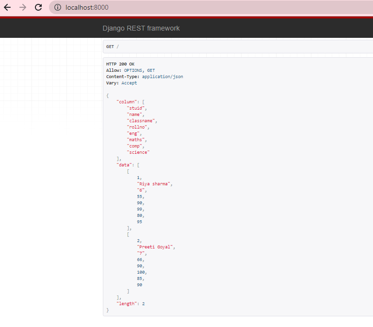
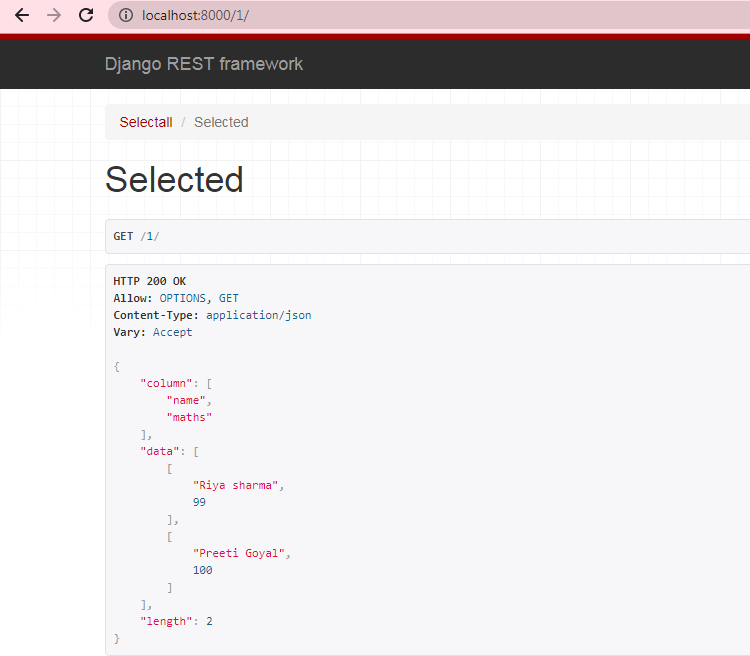
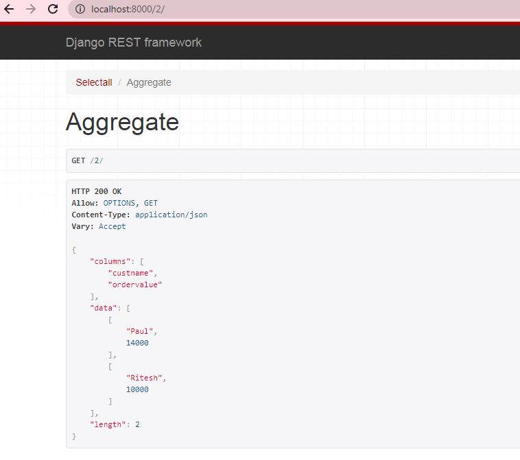

# SQL_queries_in_DRM
**Creating virtual environment is not necessary for this project.**

It is an API, which is built using the Django-rest framework, and it used to connect to the given database and query
the given table.**_I used postgresql for the database _.**

##Outputs

